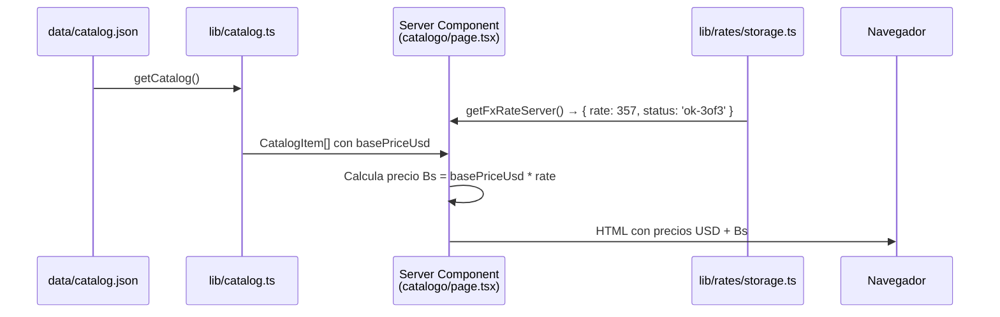
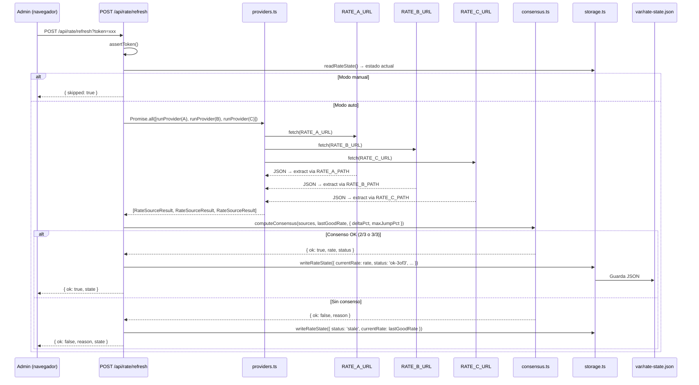
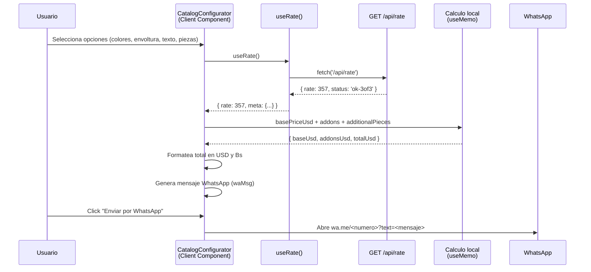
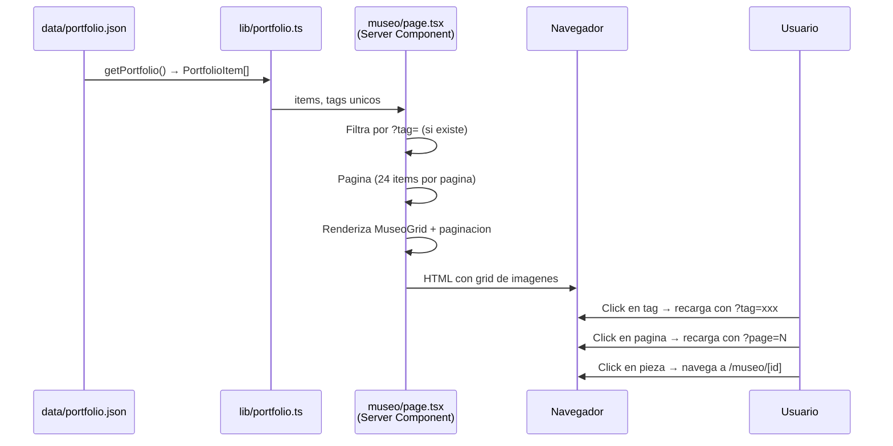
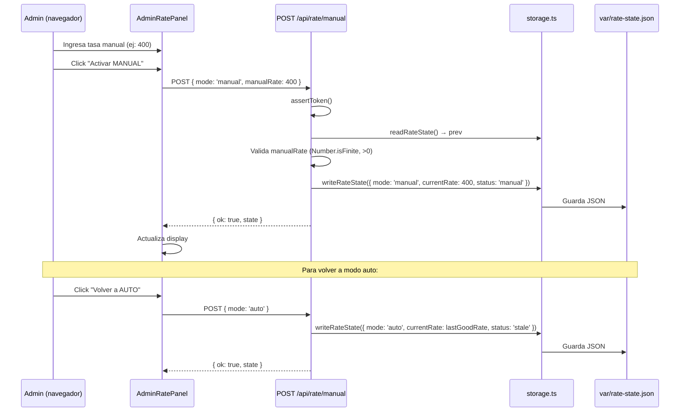

# 09 — Flujos de datos

Diagramas de los flujos principales de datos en la aplicacion.

---

## Flujo 1: Visualizacion de precios (USD → Bs)



**Archivos involucrados**:
- `data/catalog.json` — precios base en USD
- `lib/catalog.ts` — `getCatalog()`, `getPricingTable()`
- `lib/rates/storage.ts` — `readRateState()`
- `lib/rates/getRateServer.ts` — `getFxRateServer()`
- `app/catalogo/page.tsx` — renderiza precios
- `components/CatalogCard.tsx` — muestra precio USD + Bs

---

## Flujo 2: Consenso de tasa BCV (refresh automatico)



**Archivos involucrados**:
- `app/api/rate/refresh/route.ts` — endpoint
- `lib/rates/providers.ts` — `runProvider()`, `getProviderConfigs()`
- `lib/rates/consensus.ts` — `computeConsensus()`
- `lib/rates/storage.ts` — `readRateState()`, `writeRateState()`

---

## Flujo 3: Configurador de pedido → WhatsApp



**Mensaje generado** (`CatalogConfigurator.tsx:47-64`):
```
🧾 Pedido — Categoria 4
• Base: 31$ (11.067Bs)
• Colores: 2 colores
• Envoltura: Si
• Texto: Si
• Piezas adicionales: 0
• Nota: Urgente para el viernes
—
TOTAL: 40$ (14.280Bs)
Tasa BCV: 357,00 Bs/$ (ok-3of3)
```

**Archivos involucrados**:
- `components/CatalogConfigurator.tsx` — UI y logica
- `lib/rates/useRate.ts` — hook de tasa
- `app/api/rate/route.ts` — endpoint de tasa
- `lib/currency.ts` — `formatUsd()`, `formatBsFromUsd()`
- `lib/site-config.ts` — `whatsappHref()`

---

## Flujo 4: Visualizacion del portafolio/museo



**Archivos involucrados**:
- `data/portfolio.json` — datos
- `lib/portfolio.ts` — `getPortfolio()`, `getPortfolioTags()`
- `app/museo/page.tsx` — listado con filtros y paginacion
- `app/museo/[id]/page.tsx` — detalle de pieza
- `components/MuseoGrid.tsx` — grid de cards

---

## Flujo 5: Override manual de tasa BCV



**Archivos involucrados**:
- `components/AdminRatePanel.tsx` — UI del panel
- `app/api/rate/manual/route.ts` — endpoint
- `lib/rates/storage.ts` — persistencia
